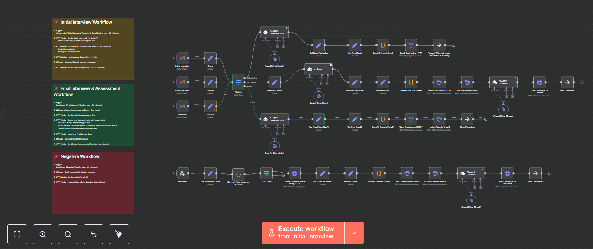

# 🚀 Flow Pilot – HR Automation Workflow

## 📝 Description
This project is an **end-to-end HR automation workflow** built in **n8n** for Flow Pilot.  
It automates the entire hiring process by detecting candidate status via **Gmail labels**, using **AI agents** to generate communication, and leveraging **HTTP API calls** to send emails, create Google Calendar events, log data to Google Sheets, and post updates to Discord.  
The result is a **fully automated, scalable, and low-maintenance hiring pipeline** that reduces manual work while improving communication consistency.


---

## 📖 Case Study

**Company:** Flow Pilot  
**Role:** Automations Specialist (Assessment Project)  
**Scenario:**  
Flow Pilot’s HR department wanted to streamline the hiring process by fully automating candidate communication, scheduling, logging, and internal updates.  
Instead of manually managing emails, calendar invites, and logging candidate status, the goal was to **use AI and HTTP API calls** to create a single workflow that could handle all three major recruitment statuses:

- 🟦 **Initial Interview**  
- 🟩 **Final Interview & Assessment**  
- 🟥 **Negative Response**  

This automation would be triggered directly from **Gmail labels** and orchestrate all steps of the process.

---

## 🎯 Objective

Build a **full automation** that:

1. ⏳ **Detects** Gmail label changes every 30 minutes (polling).  
2. 🧠 **Uses AI Agent** to generate:
   - Candidate communication emails
   - Internal Discord messages
   - Interview summaries
3. 📤 **Sends emails** via Gmail API (HTTP Request, not Gmail node).  
4. 📅 **Creates Google Calendar invites** + Google Meet links via HTTP API.  
5. 📊 **Logs data** to Google Sheets (separate tabs per label).  
6. 💬 **Updates Discord** channels via webhook with formatted summaries.

---

## 🧠 Workflow Breakdown

### 🟦 Initial Interview
**Trigger:** Gmail label `"Initial interview"` detected (polling 30min).  

**Steps:**
1. **HTTP Request (Gmail API)** → Send *thank-you email* with:
   - JotForm appointment template link  
   - Google Calendar booking link  
2. **HTTP Request (Google Calendar API)** → Once booked, create Google Meet + calendar invite for candidate & interviewer.  
3. **HTTP Request (Google Sheets API)** → Log candidate data to **Initial** tab.  
4. **AI Agent** → Create candidate summary message for Discord.  
5. **HTTP Request (Discord Webhook)** → Post to **Initial Interview** channel.

---

### 🟩 Final Interview & Assessment
**Trigger:** Gmail label `"Final interview"` detected (polling 30min).  

**Steps:**
1. **AI Agent** → Generate confirmation email for final round.  
2. **HTTP Request (Gmail API)** → Send assessment link (Google Docs).  
3. **HTTP Request (Google Calendar API)** → Create Meet link scheduled **4 days after trigger date**. Invite final interviewer & candidate.  
4. **HTTP Request (Google Sheets API)** → Append to **Final** tab.  
5. **AI Agent** → Summarize candidate & push to Discord.  
6. **HTTP Request (Discord Webhook)** → Post to **Final Interview** channel.

---

### 🟥 Negative Response
**Trigger:** Gmail label `"Negative"` detected (polling 30min).  

**Steps:**
1. **AI Agent** → Draft a polite rejection email.  
2. **HTTP Request (Gmail API)** → Send email to candidate.  
3. **HTTP Request (Google Sheets API)** → Log to **Negative** tab.

---

## 🔧 Technical Highlights

| Feature | Implementation |
|---------|----------------|
| **Trigger** | Gmail watch via polling (label-based) |
| **AI Agent** | Drafts emails, creates summaries, formats Discord posts |
| **HTTP Request (Gmail API)** | Sends all candidate emails |
| **HTTP Request (Google Calendar API)** | Creates events + Meet links |
| **HTTP Request (Google Sheets API)** | Appends candidate records to the correct tab |
| **HTTP Request (Discord Webhook)** | Sends formatted updates to the correct channel |
| **Dynamic Booking** | Links generated and included in candidate communication |

---

## 🏆 Other Implementation

- ✅ **AI Agent** generates **entire emails & Discord posts** 
- ✅ Uses **HTTP Node for Google APIs** instead of built-in n8n nodes 
- ✅ **Dynamic booking links** included in candidate emails
- ✅ **Fallback error handling** on email/calendar API calls 
- ✅ Handles **multiple Gmail label triggers** with clean `Switch` node → 
- ✅ **Well-structured workflow** with labeled node groups 

---

## 📂 File Structure
```cmd
/n8n-simple-HR-automation
│── README.md
│── workflow.json # Exported n8n workflow
│── workflow.png # Workflow preview
```


---

## 🛠 Setup & Deployment

1. **Import Workflow**  
   - Go to n8n → Import → Upload `workflow.json`.

2. **Configure Environment Variables**  
   - `GMAIL_API_KEY` – for Gmail API requests  
   - `GOOGLE_CALENDAR_API_KEY` – for Meet & event creation  
   - `GOOGLE_SHEETS_API_KEY` – for logging candidate data  
   - `DISCORD_WEBHOOK_URL` – for posting updates  
   - `BOOKING_LINK` – JotForm/Calendly link  

3. **Authorize APIs**  
   - Enable Gmail, Google Calendar, and Google Sheets APIs.  
   - Set OAuth credentials in n8n environment variables.

4. **Run Workflow**  
   - Ensure Gmail polling is active.  
   - Test by applying one of the target labels to an email.

---

## 📌 Conclusion

This workflow has **eliminated manual HR coordination tasks** for Flow Pilot by combining **Gmail label triggers**, **AI-powered content generation**, and **API-driven execution**.  
With its modular structure, additional labels and actions can be added with minimal effort.  

💡 *The result: Faster hiring process, consistent candidate communication, and centralized logging without touching a single spreadsheet manually.*

## 📞 Contact
**Developer:** Jhon Loyd Pastorin  
**Email:** [jhonloydpastorin.03@gmail.com](mailto:jhonloydpastorin.03@gmail.com)  
**LinkedIn:** [Jhon Loyd Pastorin](www.linkedin.com/in/jhon-loyd-pastorin-a84000107)  
**Portfolio:** [jlpasto-portfolio.vercel.app](https://jlpasto-portfolio.vercel.app)  

---

